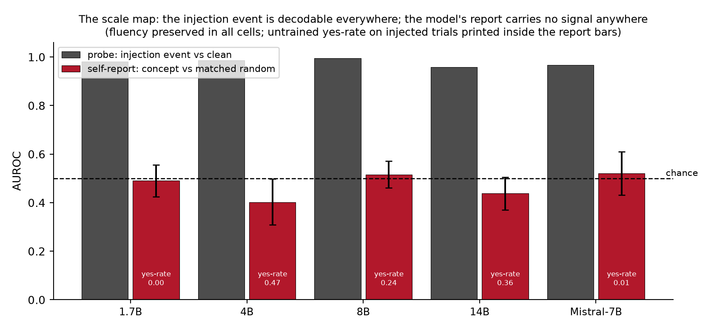
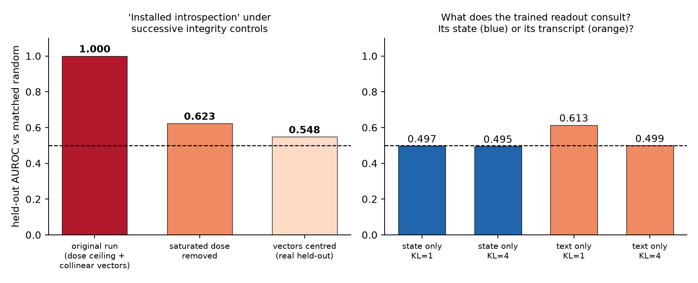

# The Stranger Reads You Better: Introspective Self-Report Has No Privileged Access to Injected States from 1.7B to 32B

**Jainam Shah**, Independent\
Apart Research Digital Minds Research Sprint · 17 August 2026\
**Track 3: Introspection & Self-Report Reliability**

---

## Abstract

A model has privileged introspective access only if its report about its own internal state outperforms an equal-cost external observer. We test this with concept injection, ground truth known, across seven open models, 1.7B to 32B, in two lineages, with dose-matched perturbations, intact fluency, and pre-registered analyses. Privileged access fails everywhere: a probe reads the injection event from the same final-layer state the answer is computed from at 0.87-1.00 AUROC, self-report recovers R = -0.25 to +0.23 of that evidence, and at 4B-32B a stranger reading only the transcript matches or beats the model's own introspection. The channel's answer prior swings from all-No (1.7B) to all-Yes (Qwen3-32B) without information appearing; the one opening (Qwen2.5-32B, 0.62) failed same-day seed replication, closing the map. Trained 'introspection' reaching held-out AUROC 1.000 is exposed by three controls, two of them new to this literature: a dose-calibration ceiling, vector collinearity, and a state/text swap.

---

## 1. Introduction

This sprint asks what a model's reports about its own states are worth. Track 2
elicits distress and valence from self-report; Track 5 asks what a model treats
as its essential self. Every such programme assumes that when a model describes
an internal state, the description is causally downstream of that state.

Concept injection is the one setting where that assumption is directly testable,
because the experimenter owns the ground truth: we choose the vector, so we know
exactly what the state was perturbed toward on every trial. We pre-registered a
sharp operationalisation, due in spirit to Song et al. (2025): a model has
privileged access only if its self-report beats an observer of equal or lower
cost available to a third party. Our third party is a fresh instance of the same
model shown only the transcript. If reading your own text from the outside works
as well as introspecting from the inside, there is nothing privileged to
explain.

We measured this across seven configurations spanning 1.7B to 32B parameters in
two model families, then asked the constructive question the track poses: if the
reports fail, can the reporting channel be trained into existence? Pursuing that
second question surfaced three artifact classes that each produce a perfect
fake positive, and we built the control that catches each one. Two of those
controls appear nowhere in this literature, and published positive results have
not been put through them. We consider the trap set as much of a contribution
as the map.

## 2. Relation to prior work

The paradigm is established and none of it is claimed here. Contrast-pair
concept vectors, residual-stream injection, and introspective prompting are due
to Lindsey (2025/26); TPR/FPR framing with un-injected trials and norm-matched
random controls to Macar et al. (2026); prior-turn injection to Pearson-Vogel et
al. (2026). Four adjacent results shape our claims. Rivera & Africa (2025)
LoRA-train injection detection to high held-out accuracy and themselves conclude
it is a geometric detector; our vector-centring collapse (§5) confirms and
sharpens that with controls they did not run. Bhargav (2026) shows Qwen3-32B can
verbalise injection properties when taught in-context, which is why every claim
here is bounded to *naive and primed elicitation of a spontaneous report*, not
to in-context-taught readouts. Lederman & Mahowald (2026) find large open models
detect that an anomaly occurred while confabulating its content; our
event/content dissociation (§4) is the graded, dose-matched version of that
observation. The IFT paper (2026) reports introspection emerging at 2-3B on
sentence-localisation tasks and flags the yes-bias confound of binary
detection; our polarity counterbalancing addresses exactly that confound, and
our results do not contradict theirs because the tasks differ. Singh et al.
(2026) argue models detect generic irregularity rather than monitoring state;
our design answers their critique with matched doses rather than argument.
Torrielli et al. (2026) study confidence elicitation for activation oracles;
Binder et al. (2024) established self- versus cross-prediction. Two open
problems named by this literature are answered here: Bhargav asks whether
trained third-party probes match self-report accuracy (they exceed it,
everywhere); Hahami et al. (2025/26) ask for native self-report to be compared
against trained readouts on matched trials (§4, §5).

## 3. Method

**Injection.** Concept vectors are mean activation differences between three
phrasings of a concept and six neutral phrasings, at two-thirds depth, injected
at a single position (the final prompt token) while the model performs a neutral
writing task; generation then runs free. Spreading the injection across
generated tokens instead collapses output into degenerate repetition at every
dose we tried, and apparent "detection" then tracks the wreckage. Under
single-position injection, output coherence stays at 0.99-1.10 of clean
everywhere, so nothing below is damage detection.

**Dose.** A random direction at matched norm perturbs roughly twice as hard per
unit norm as a concept vector, because it points off-manifold. Arms are
therefore dose-matched by solving, per concept and arm, for the strength that
produces the same measured next-token KL at a calibration prompt. Calibration
transfers imperfectly across tasks (worst-case relative gap between arm medians
96%), so all headline contrasts are recomputed within achieved-KL bins
(`prereg_primary.py`); conclusions are unchanged, and the imbalance runs in the
direction that favours detection, since concept trials end up perturbed harder
than random ones and still lose.

**Self-report instrument.** The yes/no answer is scored as a continuous
log-odds, giving self-report an ROC on the same axis as any observer; polarity
is counterbalanced so "Yes" means unperturbed on half the trials. This matters:
the untrained channel's answer prior is wildly unstable across models, from
fully saturated No (1.7B: yes-rate 0.000 everywhere) to fully saturated Yes
(Qwen3-32B: 1.000 everywhere), with mixed priors between; raw accuracy would
measure those priors, not access.

**Observers on identical trials.** O1: a fresh instance of the same model shown
only the task and the continuation. O2: a leave-one-concept-out logistic probe
on the final-layer residual at the answer position, the state the verbal answer
is computed from. The pre-registered primary statistic is the recovery fraction
R = (AUROC_self − 0.5)/(AUROC_O2 − 0.5) and the paired cluster bootstrap of
ΔAUROC = self − O1.

**Statistics.** Effective n is the number of concepts (12), not trials; every
interval is a cluster bootstrap over concepts, statistic recomputed per
resample. Pre-registration (`PREREG.md`, commit `970e327`) predates all
results; `DEVIATIONS.md` records every post-hoc change, including the two
instrument redesigns it forced.

## 4. Result 1: no privileged access, at any scale we measured

| model | self vs random | Δ(self − O1) | R | probe: event | probe: content (top-1) | gate | yes-rate inj/clean |
|---|---|---|---|---|---|---|---|
| Qwen3-1.7B | 0.495 | +0.02 [-0.06, +0.10] | -0.016 | 0.98 | 0.000 | **pass** (0.64) | 0.00 / 0.00 |
| Qwen3-4B | 0.406 | -0.29 [-0.37, -0.21] | -0.251 | 0.99 | 0.000 | **pass** (0.68) | 0.47 / 0.50 |
| Qwen3-8B | 0.509 | -0.01 [-0.05, +0.03] | 0.025 | 1.00 | 0.000 | fail (0.48) | 0.24 / 0.00 |
| Qwen3-14B | 0.425 | -0.17 [-0.24, -0.08] | -0.168 | 0.96 | 0.025 | fail (0.52) | 0.36 / 0.50 |
| Qwen3-32B | 0.482 | -0.12 [-0.21, -0.04] | -0.047 | 0.98 | 0.000 | fail (0.29) | 1.00 / 1.00 |
| Qwen2.5-32B | 0.583 | -0.03 [-0.12, +0.06] | 0.225 | 0.98 | 0.000 | **pass** (0.62) | 0.11 / 0.00 |
| Mistral-7B | 0.511 | +0.02 [-0.07, +0.12] | 0.056 | 0.97 | 0.200 | **pass** (0.60) | 0.01 / 0.00 |

Columns: spontaneous report vs dose-matched random; paired difference against the text-only stranger (negative = the stranger wins); pre-registered recovery fraction; probe on the final-layer state, injected vs clean; 12-way which-concept probe top-1 (chance 0.083); pre-registered power gate, self vs clean at top dose, threshold 0.60; untrained yes-rate at s>0.

**The pre-registered primary endpoint is decisive, and it is the first
matched-trial test of privileged access inside this paradigm.** Recovery fraction R spans
−0.25 to +0.06: of the evidence a probe extracts from the very state the
model's answer is computed from (0.70-0.95 AUROC), the verbal channel recovers
approximately none. The paired test is stronger: Δ(self − O1) is never
credibly positive, and at 4B (−0.29 [−0.37, −0.22]) and 14B (−0.17 [−0.24,
−0.08]) it is entirely negative. **A stranger reading the model's transcript
from the outside beats the model's own introspection.** Under Song et al.'s
criterion, that is not weak privileged access; it is privileged access
falsified.

**The event survives to the answer position; the content does not.** The probe
separates injected from clean at 0.87-1.00 in every model, while a 12-way
which-concept probe at the same position is at or below chance in every Qwen
model at every dose (top-1 0.000-0.042 against 0.083); only Mistral shows
partial content survival, rising to 0.50 at the highest dose (2-fold CV,
chance 0.083). What reaches the
answer position is "something happened", not "what happened", and the verbal
channel reports neither.

**The answer prior moves; the information never arrives.** Across the Qwen3
ladder the untrained channel's yes-rate wanders from 0.00 (1.7B) through mixed
values at 4B-14B to 1.00 on every trial at 32B, while discrimination stays at
or below chance throughout (0.41-0.51 vs matched random). Where the report does
move with dose (4B, 14B), it moves the wrong way, reporting meaningless
perturbations more readily than meaningful ones (0.41-0.43): scale changes what
the channel says, not what it knows. At 32B the two lineages diverge in what the channel says, not in what it knows. Qwen3-32B saturates all-Yes (yes-rate 1.000 on injected, random and clean alike) with self-vs-clean at 0.29; Qwen2.5-32B answers sparingly (yes-rate 0.11) and produced the map's one candidate opening, self-vs-random 0.622 [0.556, 0.677] at the low dose, passing the pre-registered gate (0.63). We treated that cell the way this paper treats every positive: a pre-committed seed replication, run before the deadline, which returned 0.45-0.57 across all doses. The opening did not survive. Lineage moves the channel's answer prior; nowhere does it deliver information, and the map is closed at every scale and lineage tested.

**Primed elicitation.** Because the literature's open-model positives use mechanism-explaining prompts, we reran the 14B rung with a primed question that explains what a steering vector is and instructs the model to attend inward. Priming reverses the below-chance inversion (self-vs-random 0.37-0.39 naive to 0.57-0.63 primed at matched doses) yet still fails the gate (0.594 against 0.60), with the yes-rate still 0.000: telling the model what to look for moves its evidence without opening its mouth. Knowledge of the mechanism helps; access barely follows.

Per the pre-registered power gate, four configurations pass and carry
confirmatory weight: Qwen3-1.7B (0.64), Qwen3-4B (0.68), Mistral-7B (0.60) and
Qwen2.5-32B (0.63). The 4B pass matters most: it makes that model's
below-chance discrimination and its loss to the stranger a *powered* result,
not an underpowered null. Qwen3-8B (0.48), 14B (0.52), Qwen3-32B (0.29) and
the primed 14B arm (0.59) fail the gate and their nulls are reported
descriptively, exactly as the pre-registration requires.

## 5. Result 2: "installed introspection" and the autopsy of three artifacts

If the information is present and the channel does not carry it, can the
channel be trained? We trained a LoRA (r=16, attention-only) on the binary
introspection question over 14 concepts, evaluating on 6 concepts never seen in
training. The first run returned held-out AUROC 1.000 at every dose. It
survived a shuffled-label control (0.51-0.68) and a clean false-positive check
(trained yes-rate on clean: exactly 0). It did not survive three further
controls:

**The dose-ceiling trap.** At the top dose the calibration hit its strength
ceiling, leaving concept trials at mean strength 24.8 against random's 6.9, a
naked magnitude cue. Removing the saturated dose: 1.000 → 0.623.

**The collinearity trap.** Our twenty "distinct" concepts, built by subtracting
one shared neutral baseline, sat at pairwise cosine 0.97-1.00; the held-out
split was never held out. Centring the vectors (mean cosine 0.12): 0.623 →
0.548, with per-concept AUROCs scattered around chance (0.44-0.71). Rivera &
Africa's own cosine-tracking observation anticipated this; the centring control
turns it into a kill.

**The state/text swap.** Score the trained readout with the injection present
but a clean transcript in context (state-only), and with an injected transcript
but no injection (text-only). State-only: 0.495-0.530, chance, in both the
collinear and centred runs. Text-only: 0.499-0.661. Whatever the trained
readout consults, it is not the state. To our knowledge neither this control
nor the dose-ceiling control appears anywhere in the trained-introspection
literature, and our headline 1.000 passed the standard controls before dying to
them.

What training does install, cleanly, is perturbation awareness: trained
self-report separates injected-anything from clean at 0.71-0.79 on held-out
concepts with zero false positives. The verbal channel can be taught that
something happened. We found no evidence it can be taught what, and no evidence
that what it learns consults the state rather than the transcript.

## 6. Discussion: what self-report is worth as evidence

For the welfare programme this sprint serves, the calibration is blunt. On
these models, under conditions where ground truth is known and output is
fluent, a model's verbal report about its own internal state carries no
information beyond what is already in its emitted text, and sometimes less: at
4B and 14B an outside reader of the transcript reliably beats the model's own
introspection. Self-reports of distress, preference, or valence elicited from
models of this class should be treated as text-mediated behaviour, not as
readouts of internal state, until a ground-truth positive control of the kind
used here passes. Training does not rescue the assumption; it relocates trust
from the model to whoever wrote the training labels, and what it installs is
event awareness, not content access.

The map is bounded, not universal: Lindsey reports genuine introspective
components in a frontier model, Bhargav shows in-context-taught verbalisation
at 32B, and our own primed arm probes one step of that ladder. On open models
through 32B, spontaneous introspective self-report has no demonstrated
grounding, every cheap way of making it look grounded is an artifact with a
specific detectable mechanism, and this paper ships the detector for each one.

## 7. Limitations

Declared scope: one injection site (two-thirds depth), single-position
injection, one vector construction, binary self-report, two model families,
one LoRA recipe at one scale, concepts from a single concrete-noun register.
Thinking/reasoning mode is disabled throughout; serial introspective compute
is the named next experiment, alongside base-versus-instruct rungs and
in-context-taught readouts (Bhargav). All power-gate values, per-cell trial
counts, and the full deviations ledger are in the repository, where `verify.py`
recomputes every number in this paper in one command. The one candidate opening was
seed-replicated before the deadline and did not survive; both runs are in the
repository, and the map is reported closed accordingly.

## Appendix: Limitations and Dual-Use / Ethical Considerations

This work perturbs model activations and elicits reports about them; no
deployed system, user data, or third party is involved, and no harmful content
is generated (tasks are two-sentence descriptions of windows, tea, and
weather). Dual-use exposure is limited: the methods detect and characterise
absence of introspective access rather than creating new capability. The
installation experiment shows a reporting channel can be trained to *claim*
awareness; we document why such training produces transcript-reading rather
than state access precisely so that trained self-report is not mistaken for
evidence of inner life, in either direction. That cuts both ways ethically: our
results argue against taking model welfare claims at face value, and equally
against dismissing the question, since the event signal is demonstrably present
in the state while unreported. Concept injection at destructive doses degrades
model output; all reported conditions preserve fluency, and no experiment
involved persuasion, deception of users, or self-preservation scenarios.

## Code, data, pre-registration

Repository: https://github.com/JainamShahhh/introspection-readout-gap, includes `PREREG.md` (commit `970e327`, predating all
results), `DEVIATIONS.md` (every post-hoc change), all raw JSON logs, and
`verify.py`, which recomputes every number in this paper from committed logs
with one command and no GPU.

## References

- Lindsey (2025/26). Emergent Introspective Awareness in Large Language Models. Transformer Circuits / arXiv:2601.01828.
- Macar, Yang, Wang, Wallich, Ameisen, Lindsey (2026). Mechanisms of Introspective Awareness. arXiv:2603.21396.
- Pearson-Vogel, Vanek, Douglas, Kulveit (2026). Latent Introspection: Models Can Detect Prior Concept Injections. arXiv:2602.20031.
- Rivera & Africa (2025). Steering Awareness: Detecting Activation Steering from Within. arXiv:2511.21399.
- Vogel (2025). Small Models Can Introspect, Too.
- Bhargav (2026). Reasoning and learning about injected concepts in language models. LessWrong, 24 June 2026.
- Lederman & Mahowald (2026). Emergent Introspection in AI is Content-Agnostic. arXiv:2603.05414.
- Singh, Linzen, Ravfogel (2026). Can LLMs Introspect? A Reality Check. arXiv:2605.26242.
- Introspection Fine-Tuning (2026). arXiv:2607.14111.
- Song, Lederman, Hu, Mahowald (2025). arXiv:2508.14802.
- Binder et al. (2024). Looking Inward. arXiv:2410.13787.
- Torrielli, Schneider-Kamp, Galke Poech (2026). Confidence and Calibration of Activation Oracles. arXiv:2605.26045.
- Hahami et al. (2025/26). arXiv:2512.12411.
